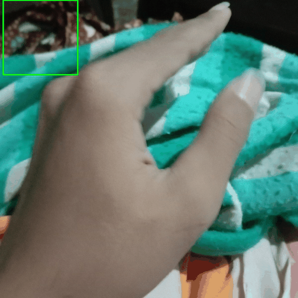
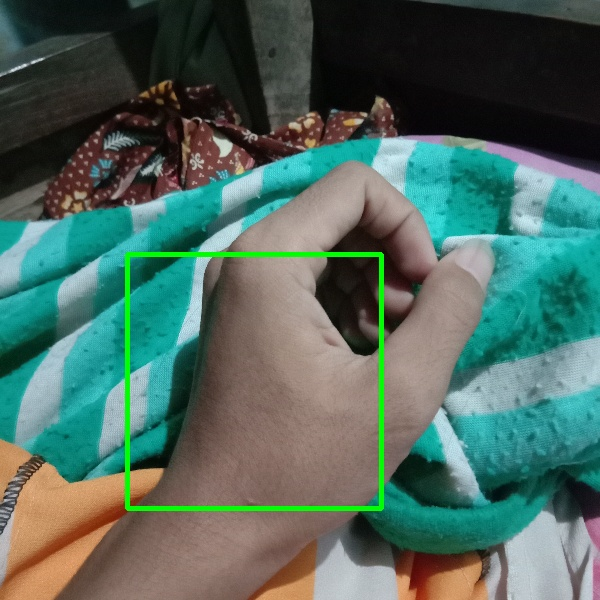

# Object-Detector-with-keras

**Source Code**

**1. detection_helper.py**

Make function image pyramid and slading window for find object from image

**Function Image Pyramid**
```bash
def image_pyramid(image, scale=1.5, minSize=(224, 224)):
    # yield the original image
    yield image

    # keep looping over the image pyramid
    while True:
        # compute the dimensions of the next image in pyramid
        w = int(image.shape[0] / scale)
        h = int(image.shape[1] / scale)
        image = cv2.resize(image, (w, h))

        # if the resized image does not meet the supplied minimum
        # size, then stop constructing the pyramid
        if image.shape[0] < minSize[1] or image.shape[1] < minSize[0]:
            break
        # yield the next image in the pyramid
        yield image
```

Function image pyramid will change image to all scale

**Function Slading Window**
```bash
def sliding_window(image, step, ws):
    # slide window across image
    for y in range(0, image.shape[0] - ws[1], step):
        for x in range(0, image.shape[1] - ws[0], step):
            result = (x, y, image[y:y + ws[1], x:x + ws[0]])
            yield result
```

Function sliding image will get every box from image



**2. Main.py**

Load model ML
```bash
# load model
model = load_model("model/handDetectorTest.keras")
```

Load Image
```bash
# load image
orig = cv2.imread("img/hand2.jpg")
if orig.shape[0] > 1000 and orig.shape[1] > 1000:
    orig = cv2.resize(orig, (600, 600))

orig = cv2.cvtColor(orig, cv2.COLOR_BGR2GRAY)
img = orig
(W, H) = orig.shape[:2]
```

Get image pyramid
```bash
pyramid = image_pyramid(orig, scale=1.5, minSize=(50, 50))
```

Get all  box from image
```bash
for image in pyramid:
    # sliding windows
    scaleImg = W / float(image.shape[1])

    for (x, y, roiOrig) in sliding_window(image, 25, (50, 50)):
        newX = int(x * scaleImg)
        newY = int(y * scaleImg)
        newW = int(50 * scaleImg)
        newH = int(50 * scaleImg)
        box = (newX, newY, newX + newW, newY + newH)
        if box == (225, 112, 337, 224):
            print(scaleImg)

        roi = img_to_array(roiOrig)
        rois.append(roi)
        locs.append(box)

        clone = orig.copy()
        cv2.rectangle(clone, (newX, newY), (newX + newW, newY + newH),
                      (0, 255, 0), 2)
```

Rescale array for input model ML
```bash
rois = np.array(rois)
rois = [(1. / 255)] * rois[np.newaxis]
rois = rois[0]
preds = model.predict(rois)
```

Get box with highest prediction
```bash
objectRaw = []
for i, pred in enumerate(preds):
    if pred[0] < 0.004:
        objectRaw.append(locs[i])
```

Make sure no boxes are stacked
```bash
objectLocs = [[0, 0, W, H]]
for object in objectRaw:
    for i, objectLoc in enumerate(objectLocs):
        if (object[0] >= objectLoc[0] or object[0] <= objectLoc[3]) or \
                (object[1] >= objectLoc[1] or object[1] <= objectLoc[4]):
            objectLocs[i] = object

        else:
            objectLocs.append(object)
```

Visualisai
```bash
for object in objectLocs:
    cv2.rectangle(img, (object[0], object[1]), (object[2], object[3]), (0, 255, 0), 4)

cv2.imshow("hand", img)
cv2.imwrite("img/handDetector1.jpg", img)
cv2.waitKey()
```



**Note**

1. I use model ML with input shape (50, 50, 1), if you have difference model ML input, you can change value ```minScale=(50, 50)``` in file main.py line 21, 
change value sliding window ```(50, 50)``` in file main.py line 31, and change value newW and newH in file main.py line 34, 35
